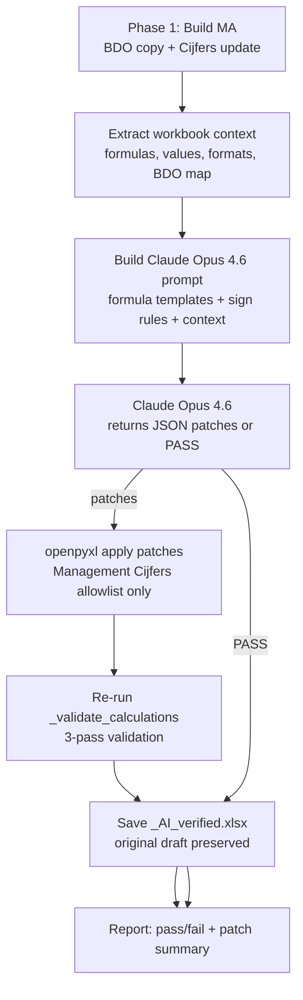

# AI-Verified Management Accounts — Claude Opus 4.6

## Goal

After the automated build produces the Management Accounts workbook (BDO data
copied into new sheet + Management Cijfers updated with new quarter formulas),
**proactively** send the full workbook context to **Claude Opus 4.6** to verify
every formula, value, sign convention, cross-sheet reference, and cell format.
If issues are found, Claude returns structured JSON patches that openpyxl
applies — producing a verified workbook the client can trust without manual
review.

This replaces the previous reactive-only approach (trigger on validation
failure) with a **proactive verification pass that always runs**.

---

## Architecture




---

## Phase A: BDO Data Copy Verification

The new BDO sheet (`BDO - Q{n}-{YY}`) is a verbatim copy of the uploaded
Cijfers file. Claude must verify:

### A1. Verbatim copy integrity

- All rows and columns from the source file are present in the new sheet
- Cell values (numbers, strings, formulas) match exactly
- No rows added, removed, or reordered

### A2. Account code to row mapping

- Every account code in column A resolves to the correct row number
- This mapping drives all Management Cijfers formulas — a single wrong
row number cascades into incorrect values throughout the P&L and BS
- Extract and include the full `{account_code: row_number}` map in the prompt

### A3. Column H formulas (LTM sums)


| Row range                    | Expected formula      |
| ---------------------------- | --------------------- |
| 6–124 (with data in col A)   | `=SUM(C{row}:G{row})` |
| 125 (Resultaat na belasting) | `=SUM(C125:G125)`     |
| 127 (Verschil balans)        | `=SUM(H5:H123)`       |


### A4. Special rows (129–136)


| Row | Label                | Columns D–G formula/value                                         |
| --- | -------------------- | ----------------------------------------------------------------- |
| 129 | afschrijving SWAP    | `=36883.33*3` in each                                             |
| 130 | Inkomsten SWAP       | Shifted values from prev quarter D←E, E←F, F←G, G←new BDO 4643000 |
| 131 | (empty)              | —                                                                 |
| 132 | Rente                | `=D117`, `=E117`, `=F117`, `=G117`; H=`=H117+H114+H116+H115`      |
| 133 | SWAP                 | `=D130`, `=E130`, etc.; H=`=SUM(D133:G133)`                       |
| 134 | Afschrijving prepaid | `=D129`, `=E129`, etc.; H=`=SUM(D134:G134)`                       |
| 135 | IC interest          | `=D115+D120`, etc.; H=`=SUM(D135:G135)`                           |
| 136 | Total                | `=SUM(D132:D135)`, etc.; H=`=SUM(D136:G136)`                      |


### A5. Formatting preservation

- Column widths, row heights, merged cells copied from source
- Cell fonts, fills, borders, number formats preserved

---

## Phase B: Management Cijfers Verification

This is the core verification. Claude receives the complete formula template
spec and the actual cell contents, then checks every row.

### B1. Balance Sheet section (rows 3–19, LTM column only)

Quarter columns are empty for Balance Sheet — only the LTM column has formulas.
All BS formulas reference the new BDO sheet with **column H**.


| Row    | Label                       | Formula type    | Account codes / pattern                                |
| ------ | --------------------------- | --------------- | ------------------------------------------------------ |
| 3      | Deferred Tax Asset          | `bdo_ref`       | `1790002`                                              |
| 4      | Real estate                 | `bdo_sum_range` | `1600000`..`1610803` (5 rows)                          |
| 5      | Financial fixed assets      | `bdo_ref`       | `1760000 + 1760300 + 1790000`                          |
| 6      | Accounts receivable         | `bdo_ref`       | `2000000 + 2000300 + 2040100`                          |
| 7      | Service costs to be settled | `bdo_sum_range` | `2502020`..`2502024` (6) + `2742000, 2741000, 2741001` |
| 8      | Prepaid expenses            | `bdo_sum_range` | `2040200`..`2040900` (3) + `2300001, 2040601`          |
| 9      | Cash                        | `bdo_sum_range` | `2400200`..`2400206` (7 rows)                          |
| 10     | Equity                      | `bdo_sum_range` | `1000002`..`1160000` (3 rows)                          |
| 11     | AC Shareholder              | `bdo_ref`       | `2000100`                                              |
| 12     | Bank loan                   | `bdo_ref`       | `1930001 + 1930101`                                    |
| 13     | Amortised fee               | `bdo_sum_range` | `1930200` (1 row)                                      |
| 14     | Accounts payable            | `bdo_ref`       | `2730000 + 2740500 + 2741004 + 2741200 + 2300000`      |
| 15     | Current account             | `bdo_sum_range` | `2730001`..`2650001` (6 rows)                          |
| 16     | VAT payable                 | `bdo_ref`       | `2512100`                                              |
| 17     | Deposits                    | `bdo_ref`       | `2740300`                                              |
| 18     | Rent Invoiced in advance    | `bdo_ref`       | `2740100`                                              |
| **19** | **Total (Equity Movement)** | `**calc`**      | `**=SUM({COL}3:{COL}18)**`                             |


**Verification checks:**

- Every `bdo_ref` formula resolves each account code to the correct row in the BDO sheet
- Every `bdo_sum_range` formula covers the right start/end rows plus additionals
- Row 19 SUM range spans exactly rows 3–18
- All formulas use column H (not G)

### B2. P&L section (rows 23–68, both quarter + LTM columns)

**Quarter column** uses BDO column **G** (current quarter mutations).
**LTM column** uses BDO column **H** (full-year closing), except for
`bdo_ref_conditional` and `manual_with_ltm` rows which use
`ltm_sum_quarters` (SUM of last 4 quarterly columns in Management Cijfers).

#### Revenue (rows 23–30)


| Row | Label                           | Type      | Quarter formula         | LTM formula          |
| --- | ------------------------------- | --------- | ----------------------- | -------------------- |
| 23  | Gross Theoretical rental income | `bdo_ref` | `=-'BDO'!G{8000003}`    | `=-'BDO'!H{8000003}` |
| 24  | (Financial vacancy)             | `bdo_ref` | `=-'BDO'!G{8000004}`    | `=-'BDO'!H{8000004}` |
| 25  | Gross rental income             | `calc`    | `=SUM({COL}23:{COL}24)` | same                 |
| 26  | Vacancy %                       | `calc`    | `={COL}25/{COL}23-1`    | same                 |
| 27  | Service costs charged           | `bdo_ref` | `=-'BDO'!G{8400600}`    | `=-'BDO'!H{8400600}` |
| 28  | (Vacancy costs)                 | `bdo_ref` | `=-'BDO'!G{8400700}`    | `=-'BDO'!H{8400700}` |
| 29  | (Service costs)                 | `bdo_ref` | `=-'BDO'!G{8400800}`    | `=-'BDO'!H{8400800}` |
| 30  | Service charges                 | `calc`    | `=SUM({COL}27:{COL}29)` | same                 |


#### Property expenses (rows 32–44)


| Row    | Label                         | Type       | Account codes                                                                             |
| ------ | ----------------------------- | ---------- | ----------------------------------------------------------------------------------------- |
| 32     | (Maintenance & repair)        | `bdo_ref`  | `4100400`                                                                                 |
| 33     | (VVE costs)                   | `bdo_ref`  | `4101000`                                                                                 |
| 34     | (Insurance)                   | `bdo_ref`  | `4310400`                                                                                 |
| 35     | (Landlord tax)                | `constant` | `0`                                                                                       |
| 36     | (Property tax)                | `bdo_ref`  | `4100900`                                                                                 |
| 37     | (Water/sewerage)              | `bdo_ref`  | `4100410 - 4101010 - 4101020`                                                             |
| 38     | (Agent costs)                 | `bdo_ref`  | `4312600`                                                                                 |
| 39     | (Brokerage costs)             | `bdo_ref`  | `4310800`                                                                                 |
| 40     | (Other costs)                 | `bdo_ref`  | `4501200 - 4501300 - 4300200 - 4300500 - 4310700 - 4311000 - 4311900 - 4319800 - 4101300` |
| 41     | (Accountant costs)            | `bdo_ref`  | `4310600`                                                                                 |
| 42     | (Advisory costs)              | `bdo_ref`  | `4311800`                                                                                 |
| 43     | (Intercompany costs)          | `constant` | `0`                                                                                       |
| **44** | **Property related expenses** | `**calc`** | `**=SUM({COL}32:{COL}43)**`                                                               |


#### Operating result (rows 45–57)


| Row | Label                   | Type              | Pattern / codes                                                   |
| --- | ----------------------- | ----------------- | ----------------------------------------------------------------- |
| 45  | Net rental income       | `calc`            | `={COL}25+{COL}30+{COL}44`                                        |
| 46  | (Management fees)       | `bdo_ref`         | `4051400`                                                         |
| 47  | (Mgmt fee Shareholder)  | `bdo_ref`         | `4310500`                                                         |
| 48  | EBITDA rental operation | `calc`            | `={COL}47+{COL}46+{COL}45`                                        |
| 50  | Cash proceeds sale      | `manual_with_ltm` | Manual value from sales tracker; LTM = SUM of last 4 quarter cols |
| 51  | (Cost of sales)         | `calc`            | `=-({COL}50-{COL}53)`                                             |
| 53  | EBITDA from Sales       | `bdo_ref`         | `4730200`                                                         |
| 55  | Total EBITDA            | `calc`            | `={COL}53+{COL}48`                                                |
| 56  | (Depreciation)          | `bdo_ref`         | `4730000`                                                         |
| 57  | EBIT                    | `calc`            | `={COL}56+{COL}55`                                                |


#### Interest, tax, and result (rows 60–68)


| Row    | Label               | Type                  | Quarter                                                         | LTM                         |
| ------ | ------------------- | --------------------- | --------------------------------------------------------------- | --------------------------- |
| 60     | (Interest SFA)      | `bdo_ref`             | `-'BDO'!G{4611000}-G{4613000}-G{4620200}-G{4623001}-G{4642000}` | Same with H                 |
| 61     | (Prepaid deriv SFA) | `bdo_ref_conditional` | `'BDO'!G{1790000}` (no sign)                                    | `=SUM(last 4 quarter cols)` |
| 64     | (Interest Hedge)    | `bdo_ref_conditional` | `-'BDO'!G{4643000}-G{1790000}-G{4642000}`                       | `=SUM(last 4 quarter cols)` |
| 65     | (Interest DMRRP)    | `bdo_ref`             | `-'BDO'!G{4663000}`                                             | Same with H                 |
| **66** | **EBT**             | `**calc`**            | `**=SUM({COL}57:{COL}65)**`                                     | same                        |
| 67     | (Delta DTA & CIT)   | `bdo_ref`             | `-'BDO'!G{9500000}-G{9510000}`                                  | Same with H                 |
| **68** | **Direct result**   | `**calc`**            | `**={COL}67+{COL}66**`                                          | same                        |


**All `bdo_ref` rows use `sign: "-"` which negates the BDO value.** This is
because BDO stores revenue/profit as negative (Dutch trial balance convention)
and Management Cijfers uses positive-for-income.

### B3. Critical cross-check validations

Claude must confirm these invariants:

1. **BS row 19 == P&L row 68** — Total Equity Movement must equal Direct
  Result within tolerance of 1.0. Both are computed from the same BDO data
   via different paths (BS sums all account mutations; P&L chains through
   the income statement).
2. **BDO ground truth** — The "Resultaat na belasting" row in the BDO sheet
  (columns D+E+F+G summed, then **negated** due to sign convention) must
   match both row 19 and row 68.
3. **LTM SUM ranges** — Every `ltm_sum_quarters` formula must span exactly
  the last 4 quarterly columns (e.g., `=SUM(X50:AA50)` for 4 quarters
   ending at column AA). After column insertion, ranges that excluded the
   new column must be caught and fixed.
4. **No missing account codes** — Every account code referenced in a
  `bdo_ref` or `bdo_sum_range` template must resolve to an actual row
   in the BDO sheet. Missing codes produce incorrect zeros.
5. **Row 50 Cash proceeds** — Must contain the sales tracker value (manual
  entry), not a formula. LTM column must SUM the last 4 quarter values.
6. **Calc formula chain integrity** — Walk the dependency chain
  `68 ← 67+66 ← SUM(57:65) ← 56+55 ← 53+48 ← ...` and verify each
   intermediate row references the correct rows in its own column.

### B4. Bank Account Overview (rows 104–120, LTM column)


| Row | Content           | Expected formula                                |
| --- | ----------------- | ----------------------------------------------- |
| 106 | Date header       | `"Per DD-MM-YYYY"` matching current quarter end |
| 107 | ABN AMRO RENT     | `='BDO - Q{n}-{YY}'!H35`                        |
| 108 | ABN AMRO MAINT    | `='BDO - Q{n}-{YY}'!H34`                        |
| 109 | ABN AMRO EXP      | `='BDO - Q{n}-{YY}'!H36`                        |
| 110 | ABN AMRO GEN      | `='BDO - Q{n}-{YY}'!H32`                        |
| 111 | ABN AMRO DEP      | `='BDO - Q{n}-{YY}'!H33`                        |
| 112 | ABN AMRO CAPEX    | `='BDO - Q{n}-{YY}'!H37`                        |
| 113 | ABN AMRO DISPOSAL | `='BDO - Q{n}-{YY}'!H31`                        |
| 114 | Total             | `=SUM({LTM_COL}107:{LTM_COL}113)`               |


### B5. Formatting and design verification

Claude must confirm these formatting rules match the previous quarter column:


| Aspect                         | Expected                                                                     |
| ------------------------------ | ---------------------------------------------------------------------------- |
| **Font**                       | Avenir Book, size 10; bold for totals and headers                            |
| **Number format**              | `_(* #,##0_);_(* \(#,##0\);_(* "-"??_);_(@_)` for all financial cells        |
| **Fill colors**                | Section header/total rows have blue bar fills (copied from prev quarter col) |
| **LTM column fill**            | Same fill pattern as quarter column (blue bars for same rows)                |
| **Font color**                 | Inherited from previous quarter column per row                               |
| **Column width**               | Matches previous quarter column width for both new quarter and LTM cols      |
| **Outline grouping**           | New quarter column: `outlineLevel=1, hidden=False`                           |
| **Row 22 header**              | Quarter label (e.g., "Q4 2025") with full style from prev header             |
| **LTM header (row 22)**        | `"LTM Q4 2025"`                                                              |
| **Row 2 date**                 | Period end date in LTM column only, with date number format                  |
| **Row 1 title**                | `"Management Accounts QSP ESS B.V. - Q{n} {year}"`                           |
| **BS rows (3-19) quarter col** | Empty / None (no data in quarter cols for Balance Sheet)                     |


---

## Phase C: Claude Opus 4.6 Prompt Design

### C1. Context payload (extracted from workbook)

The prompt must include all of the following, extracted programmatically:

1. **BDO account-code-to-row map** — `{"1790002": 6, "1600000": 8, ...}`
  extracted via `_build_row_map()` from the new BDO sheet
2. **BDO label-to-row map** — `{"swap": 133, "resultaat na belasting": 125, ...}`
  for special non-numeric rows
3. **Formula templates** — the full `config/formula_templates.yaml` content
  (both `balance_sheet` and `profit_loss` sections) so Claude knows what
   each row *should* contain
4. **Actual cell contents** for the new quarter column and LTM column:
  - Rows 3–19 (BS): formula string + evaluated value
  - Rows 22–68 (P&L): formula string + evaluated value
  - Rows 104–120 (Bank): formula string + evaluated value
5. **Shadow P&L** — `{row: {label, value, type, missing_codes}}` computed
  from raw BDO data, representing what the formulas *should* produce
6. **Shadow BS** — same structure for Balance Sheet rows
7. **BDO Resultaat na belasting** — raw value from BDO (columns D-G sum),
  plus sign-adjusted value (negated)
8. **Formatting snapshot** — for each row in the new quarter and LTM columns:
  `{font_name, font_size, bold, font_color, fill_color, number_format}`
9. **Quarter/year metadata** — current quarter, year, BDO sheet name,
  summary sheet name, period end date, previous quarter label

### C2. Prompt structure

```
ROLE: You are verifying a Management Accounts Excel workbook for QSP ESS B.V.
      The workbook was auto-generated and you must check every formula, value,
      and format for correctness.

CONTEXT:
  [BDO account-to-row map]
  [Formula templates]
  [Actual cell contents — formulas and values]
  [Shadow P&L and Shadow BS]
  [BDO ground truth]
  [Formatting snapshot]
  [Sign convention rules]

SIGN CONVENTION:
  BDO stores revenue and profit as NEGATIVE numbers (Dutch trial balance).
  Management Cijfers uses POSITIVE for income. All bdo_ref formulas with
  sign: "-" negate the BDO value to convert.

CHECKS TO PERFORM:
  1. For every bdo_ref/bdo_sum_range formula: verify the row numbers match
     the account codes in the BDO map
  2. For every calc formula: verify it references the correct rows
  3. Confirm BS row 19 == P&L row 68 (within tolerance 1.0)
  4. Confirm BDO Resultaat (negated) matches row 19 and row 68
  5. Confirm LTM SUM ranges cover exactly 4 quarterly columns
  6. Confirm Bank Account formulas (107-113) reference correct BDO H rows
  7. Confirm formatting matches spec for every row
  8. Flag any missing account codes

RESPONSE FORMAT (strict JSON only):
{
  "status": "PASS" | "ISSUES_FOUND",
  "checks_performed": <count>,
  "issues": [
    {
      "sheet": "Management Cijfers - Q4 2025",
      "row": 60,
      "col": 28,
      "col_letter": "AB",
      "kind": "formula" | "value" | "format" | "missing",
      "current": "=-'BDO - Q4-25'!G91-'BDO - Q4-25'!G93",
      "expected": "=-'BDO - Q4-25'!G91-'BDO - Q4-25'!G92-'BDO - Q4-25'!G93-'BDO - Q4-25'!G94-'BDO - Q4-25'!G95",
      "explanation": "Row 60 is missing references to accounts 4620200, 4623001"
    }
  ],
  "patches": [
    {
      "sheet": "Management Cijfers - Q4 2025",
      "row": 60,
      "col": 28,
      "kind": "formula",
      "value": "=-'BDO - Q4-25'!G91-'BDO - Q4-25'!G92-..."
    }
  ],
  "validation_summary": {
    "bs_row_19": <value>,
    "pl_row_68": <value>,
    "bdo_resultaat_adjusted": <value>,
    "all_match": true | false
  },
  "notes": "Free-text summary of findings"
}
```

### C3. Prompt size management

- Send the full formula templates (they are small — ~400 lines of YAML)
- Send BDO map (typically ~120 account codes)
- Send actual cell contents only for the new quarter + LTM columns
(not the 20+ historical columns)
- Send shadow P&L/BS as compact JSON (~50 rows each)
- Total prompt fits within Claude Opus 4.6 context window comfortably

---

## Phase D: Patch Application and Re-Validation

### D1. Patch safety rules (enforced in code, not prompt)

- **Allowlisted sheets**: only sheets containing "Management Cijfers"
- **Never touch**: any sheet starting with "BDO" or any other sheet
- **Allowlisted rows**: 1–120 (covers BS, P&L, Bank sections)
- **Formula parse check**: if `kind == "formula"`, verify it starts with `=`
and does not reference disallowed sheets
- **Format patches**: only font, fill, number_format, alignment, border

### D2. Application flow

1. Load the draft workbook with `openpyxl`
2. For each patch in `patches[]`:
  - Validate against allowlist
  - Apply formula/value/format to the specified cell
  - Log the change (old value → new value)
3. Save as `Management Accounts Q{n} {year} - Draft 1_AI_verified.xlsx`

### D3. Re-validation

1. Re-run `_validate_calculations()` on the patched workbook
2. Compare results: did BS row 19 == P&L row 68 pass?
3. Compare with BDO ground truth
4. If still failing, flag `"AI verification did not fully resolve"` and
  keep both original draft and AI-verified version

### D4. Output

Both files are listed in the orchestrator/API results:

- `Management Accounts Q4 2025 - Draft 1.xlsx` (original)
- `Management Accounts Q4 2025 - Draft 1_AI_verified.xlsx` (after Claude)

Plus a verification report:

```json
{
  "claude_status": "PASS" | "ISSUES_FOUND",
  "patches_applied": 3,
  "revalidation_passed": true,
  "original_file": "...",
  "verified_file": "..."
}
```

---

## Effort Estimate


| Work item                                                                      | Hours     |
| ------------------------------------------------------------------------------ | --------- |
| Context extractor (BDO map, cell contents, shadow models, formatting snapshot) | 6–8       |
| Claude Opus 4.6 prompt design + strict JSON schema + sign convention rules     | 6–10      |
| Anthropic API integration (Opus 4.6 model, timeouts, retries, logging)         | 3–4       |
| Patch applier with allowlist + formula validation + format patching            | 6–8       |
| Orchestrator hook (always-run, dual output, API fields)                        | 3–4       |
| Re-validation integration + comparison reporting                               | 2–3       |
| Integration tests (synthetic + real Q3/Q4 data, prompt iteration)              | 6–8       |
| **Total**                                                                      | **32–45** |


---

## Risks and Mitigations


| Risk                                            | Mitigation                                                                           |
| ----------------------------------------------- | ------------------------------------------------------------------------------------ |
| Hallucinated formulas / wrong cell addresses    | Allowlist enforcement in code; formula parse check; re-validation proves correctness |
| Large prompt exceeding context                  | Send only new quarter + LTM columns (not 20+ historical); templates are compact      |
| Account codes missing from BDO                  | Shadow model flags missing codes; Claude confirms against the map                    |
| Sign convention confusion                       | Explicit sign rules in prompt; shadow model uses same logic as code                  |
| Formatting changes breaking client expectations | Copy from previous quarter column as baseline; Claude only flags deviations          |
| Claude returns invalid JSON                     | JSON schema validation; retry once on parse failure; fall back to original draft     |


---

## Key Design Principles

1. **Proactive, not reactive** — verification runs on every build, not just on failure
2. **Original preserved** — the draft file is never modified; AI-verified is a separate artifact
3. **Code enforces safety** — allowlists, formula validation, and re-validation are in Python, not delegated to the prompt
4. **Claude verifies, code applies** — Claude's job is analysis and patch generation; openpyxl does the writing
5. **Full coverage** — every row in BS (3-19), P&L (23-68), and Bank (104-120) is checked, plus formatting

